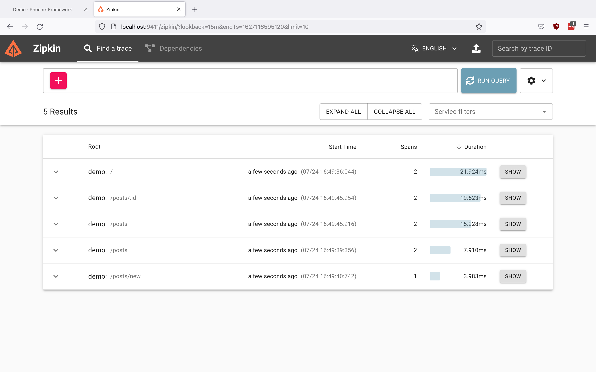
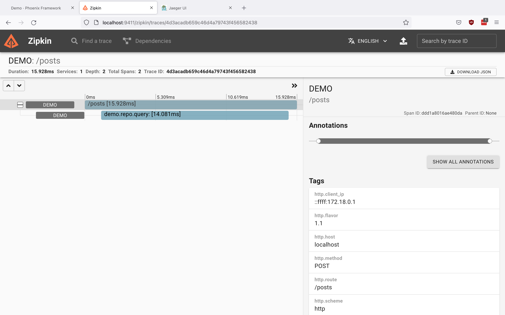
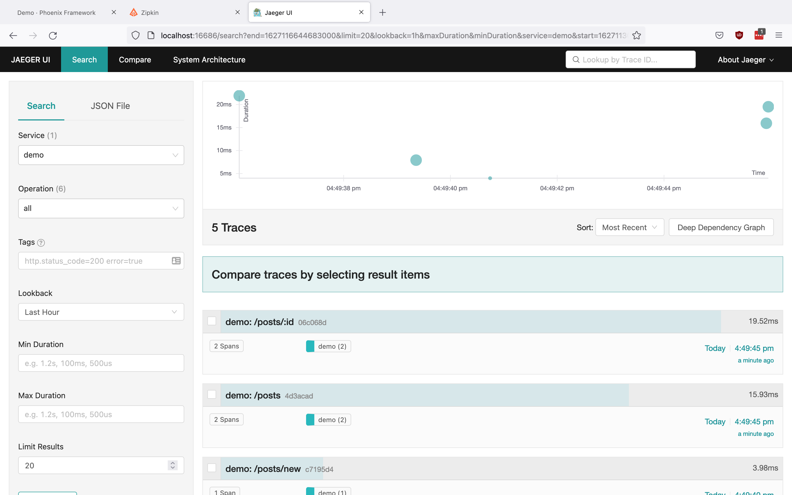
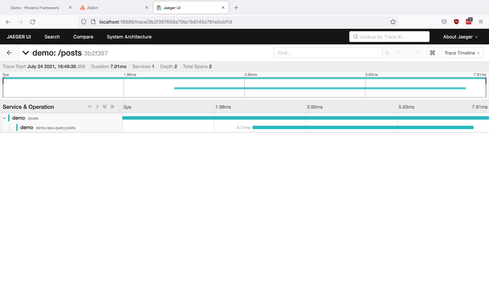
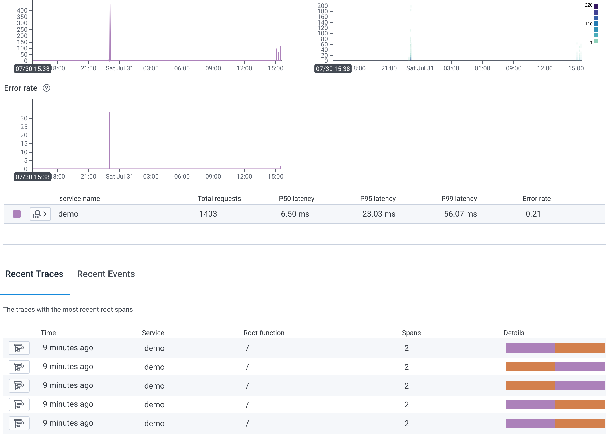
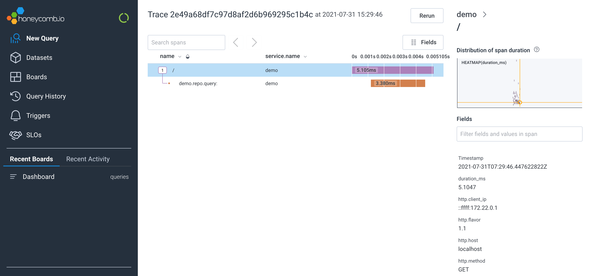
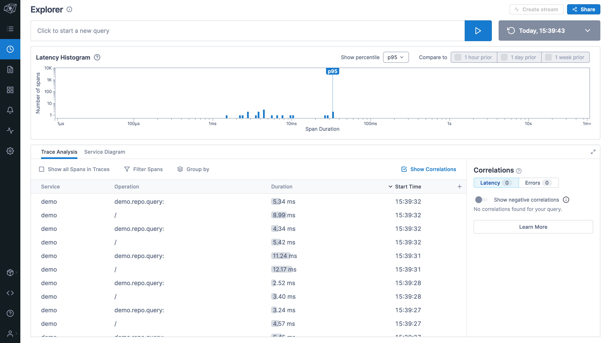
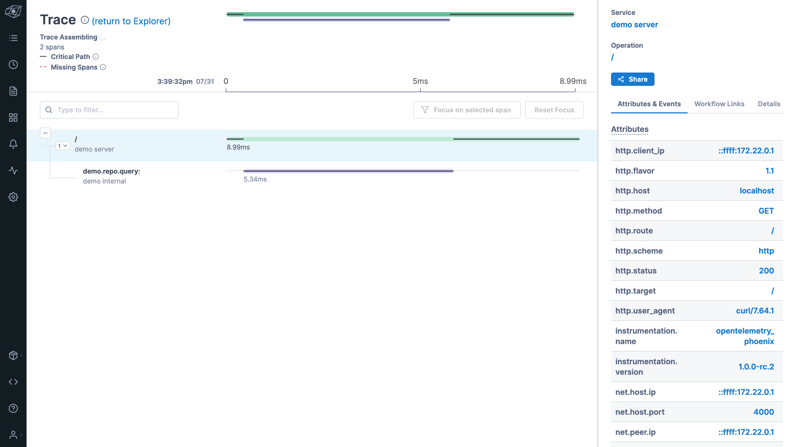

# Phoenix Ecto OpenTelemetry Example

This is a sample repository that demo how to setup OpenTelemetry for Phoenix application
with `opentelemetry_phoenix` and `opentelemetry_ecto`.

Here, we are using `opentelemetry_exporter` to export the traces to [
OpenTelemetry Collector][0]. The collector in turn export the traces to [Zipkin][1] and [
Jaeger][2] respectively.

Additionally, we also include the OpenTelemetry Collector configuration to
export the traces to services like [Honeycomb](https://www.honeycomb.io/) and [Lightstep](https://lightstep.com/).

## Getting Stated

By default, we only configure our OpenTelemetry collector to export traces to
the local Zipkin and Jaeger.

Assuming you already have Docker and Docker Compose installed:

1. Run `docker-compose up` to start the Phoenix application, PostgreSQL,
   OpenTelemetry Collector, Zipkin and Jaeger.
2. Run migration on another terminal with:
    ```
    docker exec -it basic_phoenix_ecto_phoenix_1 /bin/ash ./bin/demo eval 'Demo.Release.migrate()
    ```
3. Browse to http://localhost:4000 and play around with
   http://localhost:4000/posts.
4. Visit Zipkin at http://localhost:9411 and hit `Run Query` to look the the sample trace.
5. Visit Jaeger UI at http://localhost:16686, select `demo` under Service  and click `Find Trace` to
look at the sample trace.
6. Run `docker-compose down` to destroy the created resources.

### Screenshot

#### Zipkin

Home:


Traces:


#### Jaeger

Home:


Traces:


## Exporting to other services

In general, as long as the services support ingesting data from OTLP protocol,
we should be able to export the data to the services by specifying the endpoint
of the service with an acesss/api key.

Generally, there are two ways to export your telemetry data to these services:

- Export directly to the OTLP ingestion endpoint of the service:
  ```
  opentelemetry_exporter -> Service OpenTelemetry endpoint
  ```
- Export to OpenTelemetry Collector first, which then export to the OTLP
  ingestion endpoint of the service:
  ```
  opentelemetry_exporter -> OpenTelemetry Collector -> Service
  OpenTelemetry endpoint
  ```

For example, at the time of writing, NewRelic support for OTLP ingest is in
pre-release. And here's the documentation for exporting the data you have to
NewRelic:

- [Export your telemetry data to
  NewRelic](https://docs.newrelic.com/docs/integrations/open-source-telemetry-integrations/opentelemetry/opentelemetry-quick-start/#export)
- [Export data to an OpenTelemetry
  Collector](https://docs.newrelic.com/docs/integrations/open-source-telemetry-integrations/opentelemetry/opentelemetry-quick-start/#collector)

So, search for the services documentation on whether they support OTLP protocol
for their ingestion.

We also include example configuration to export your telemetry data to Honeycomb
and Lightstep.

### Exporting to Honeycomb

As documented in [here][3], we can configure our `opentelemetry_exporter` to
export our telemetry data directly to the Honeycomb OpenTelemetry endpoint with
the following configuration in `config/releases.exs`:

```elixir
config :opentelemetry, :processors,
  otel_batch_processor: %{
    exporter: {:opentelemetry_exporter, %{
      endpoints: [
        {:https, 'api.honeycomb.io', 443 , [
        ]}
      ],
      headers: [
        # For more secure approach, consider using environment variable:
        #   {"x-honeycomb-team", System.fetch_env!("HONEYCOMB_API_KEY")}
        {"x-honeycomb-team","<YOUR_API_KEY>"},
        {"x-honeycomb-dataset", "<YOUR_DATASET_NAME>"}
      ]
    }}
  }
```

Alternatively, if you are using OpenTelemtry Collector instead,
as documented [here][4], you can configure your `otel-collector-config.yaml`
with the following configuration:

```yaml
exporters:
  otlp:
    endpoint: "api.honeycomb.io:443"
    headers:
      "x-honeycomb-team": "YOUR_API_KEY"
      "x-honeycomb-dataset": "YOUR_DATASET"
# ...
service:
  extensions: [zpages]
  pipelines:
    traces:
      receivers: [otlp]
      processors: [batch]
      exporters: [otlp]
```

#### Screenshot

Home:


Traces:


### Exporting to Lightstep

At the time of writing, Lightstep has no documentation on
what are their OpenTelemetry ingestion endpoint. Hence unlike in Honeycomb,
where we can export directly from `opentelemetry_exporter`, we have to export
the data to Lightstep through OpenTelemetry collector.

As documented [here][5], here's how you can configure your `otel-collector-config.yaml` to send your
data to Lightstep from your OpenTelemetry Collector:

```yaml
exporters:
  otlp:
    endpoint: ingest.lightstep.com:443
    headers:
      "lightstep-access-token": "<YOUR_ACCESS_TOKEN>"
# ...
service:
  extensions: [zpages]
  pipelines:
    traces:
      receivers: [otlp]
      processors: [batch]
      exporters: [otlp]
```

#### Screenshot

Explorer:


Traces:



[0]: https://github.com/open-telemetry/opentelemetry-collector/
[1]: https://zipkin.io/
[2]: https://www.jaegertracing.io/
[3]: https://docs.honeycomb.io/getting-data-in/opentelemetry/
[4]: https://docs.honeycomb.io/getting-data-in/opentelemetry/otel-collector/
[5]: https://docs.lightstep.com/docs/already-using-collectors
